# 1.大纲

利用这个梯度进行更新参数使得模型的 loss 逐渐的降低

- 优化器（什么是优化器，优化器运行机制、属性和方法，常用的优化器介绍）
- 学习率调整策略(为什么调整学习率， 六种学习率调整策略）
- 梳理总结

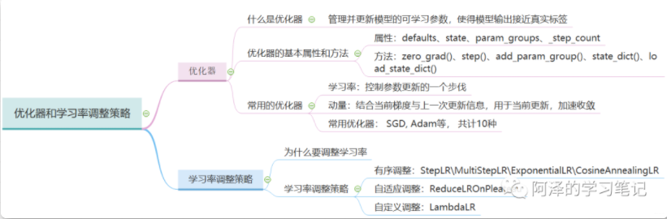

# 2.优化器

## **2.1 什么是优化器**

Pytorch 的优化器：管理并更新模型中可学习参数的值，使得模型输出更接近真实标签。

一般使用梯度下降的方式

- 导数：函数在指定坐标轴上的变化率；
- 方向导数：指定方向上的变化率；
- 梯度：一个向量，方向为方向导数取得最大值的方向。

## 2.2 Optimizer 的基本属性和方法

Pytorch 里面优化器的基本属性：

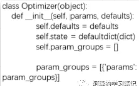

- defaults: 优化器超参数，里面会存储一些学习了，momentum 的值，衰减系数等
- state: 参数的缓存，如 momentum 的缓存（使用前几次梯度进行平均）
- param_groups: 管理的参数组，这是个列表，每一个元素是一个字典，在字典中有 key，key 里面的值才是我们真正的参数（**「这个很重要，进行参数管理」**）
- _step_count: 记录更新次数，学习率调整中使用，比如迭代 100 次之后更新学习率的时候，就得记录这里的 100

优化器里面的基本方法：

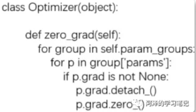

- zero_grad()：清空所管理参数的梯度， 里注意Pytorch有一个特性就是**「张量梯度不自动清零」**
- step(): 执行一步更新
- add_param_group(): 添加参数组，我们知道优化器管理很多参数，这些参数是可以分组的，我们对不同组的参数可以设置不同的超参数，比如模型 finetune 中，我们希望前面特征提取的那些层学习率小一些，而后面我们新加的层学习率大一些更新快一点，就可以用这个方法

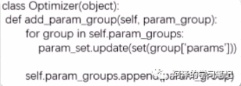

- state_dict(): 获取优化器当前状态信息字典
- load_state_dict(): 加载状态信息字典，这两个方法用于模型断点的一个续训练， 所以我们在模型训练的时候，一般多少个 epoch 之后就要保存当前的状态信息。
- 

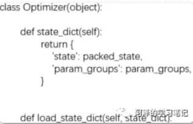

优化器具体的方法：

1.step(): 一次梯度下降更新参数

2.zero_grad()：将梯度清零

3.add_param_group(): 添加参数组 这个是在模型的迁移学习中非常实用的一个方法，我们看看怎么用：

4.state_dict()和load_state_dict()

这两个方法用于保存和加载优化器的一个状态信息，通常用在断点的续训练， 比如我们训练一个模型，训练了10次停电了， 那么再来电的时候我们就得需要从头开始训练，但是如果有了这两个方法，我们就可以再训练的时候接着上次的次数继续， 所以这两个也非常实用。

## 2.3 常用的优化器

### 2.3.1 学习率

参数更新公式：

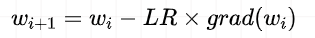

在梯度下降过程中，学习率起到了控制参数更新的一个步伐的作用

### 2.3.2 动量

Momentum：结合当前梯度与上一次更新信息， 用于当前更新。

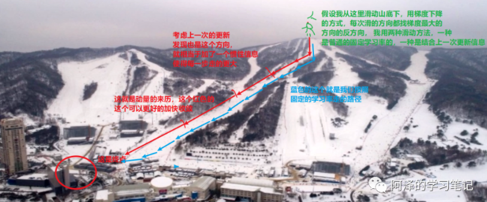

指数加权平均在时间序列中经常用于求取平均值的一个方法：要求取当前时刻的平均值，距离当前时刻越近的那些参数值，它的参考性越大，所占的权重就越大，这个权重是随时间间隔的增大呈指数下降，所以叫做指数滑动平均。

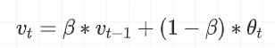

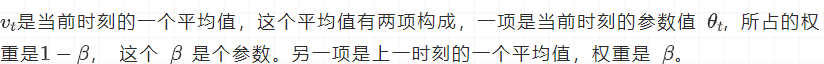

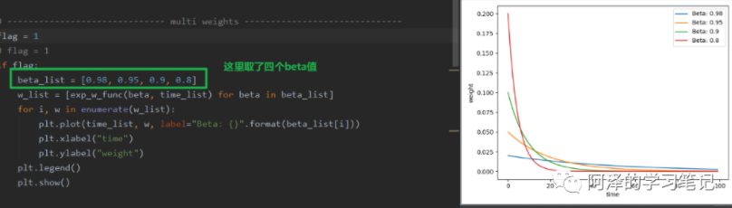

**「beta在这里控制着记忆周期的长短，或者平均过去多少天的数据」**

，这个天数就是, 通常beta设置为0.9， 物理意义就是关注过去10天左右的一个温度。

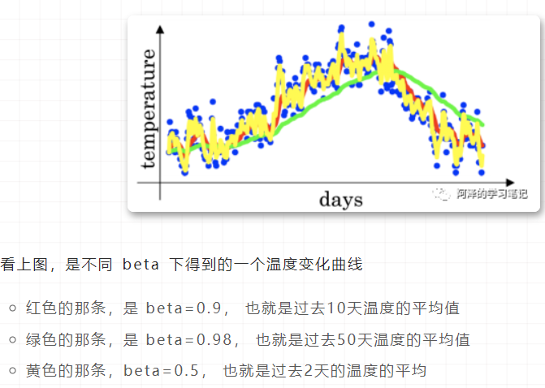

Momentum 梯度下降， 基本的想法是**「计算梯度的指数加权平均数，并利用该梯度更新权重」**

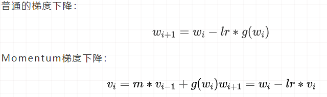

### 2.3.3 常用优化器介绍

#### optim.SGD

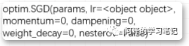

- param: 管理的参数组
- lr: 初识学习率
- momentum：动量系数， beta
- weight_decay: L2 正则化系数
- nesterov: 是否采用 NAG

#### 优化器

- optim.SGD: 随机梯度下降法
- optim.Adagrad: 自适应学习率梯度下降法
- optim.RMSprop: Adagrad 的改进
- optim.Adadelta: Adagrad 的改进
- optim.Adam: RMSprop 结合 Momentum
- optim.Adamax: Adam 增加学习率上限
- optim.SparseAdam: 稀疏版的 Adam
- optim.ASGD: 随机平均梯度下降
- optim.Rprop: 弹性反向传播
- optim.LBFGS: BFGS 的改进

# 3.学习率调整策略

##  3.1 为什么要调整学习率

**「学习率前期要大，后期要小」**

##  3.2 Pytorch的学习率调整策略

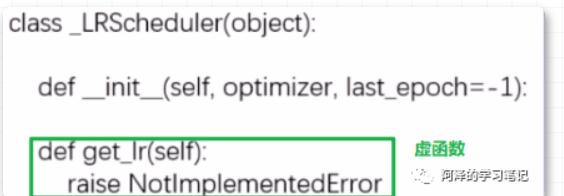

主要属性：

- optimizer: 关联的优化器， 得需要先关联一个优化器，然后再去改动学习率
- last_epoch: 记录epoch数， 学习率调整以epoch为周期
- base_lrs: 记录初始学习率

主要方法：

- step(): 更新下一个epoch的学习率， 这个是和用户对接
- get_lr(): 虚函数， 计算下一个epoch的学习率， 这是更新过程中的一个步骤

定义优化器的时候，这时候会完成优化器的初始化工作， 主要有关联优化器(`self.optimizer`属性), 然后初始化`last_epoch`和`base_lrs`(记录原始的学习率，后面`get_lr`方法会用到)。然后就是用Scheduler，我们是直接用的`step()`方法进行更新下一个epoch的学习率（这个千万要注意放到epoch的for循环里面而不要放到batch的循环里面 ），而这个内部是在`_Scheduler`类的`step()`方法里面调用了`get_lr()`方法， 而这个方法需要我们写Scheduler的时候自己覆盖，告诉程序按照什么样的方式去更新学习率，这样程序根据方式去计算出下一个epoch的学习率，然后直接更新进优化器的`_param_groups()`里面去。

#### 六种学习率调整策略：

##### StepLR 功能：等间隔调整学习率

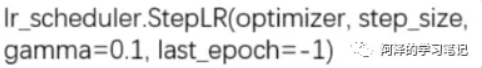

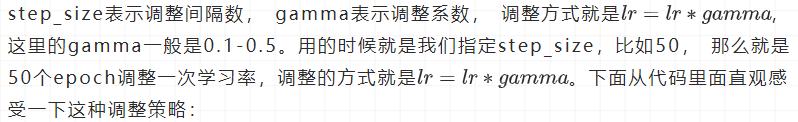

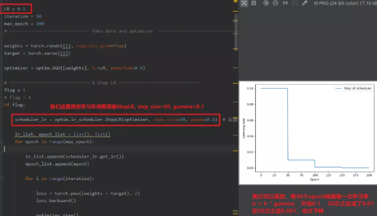

##### MultiStepLR 功能：按给定间隔调整学习率

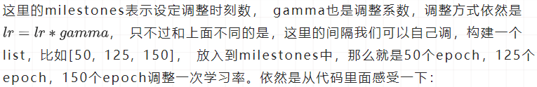

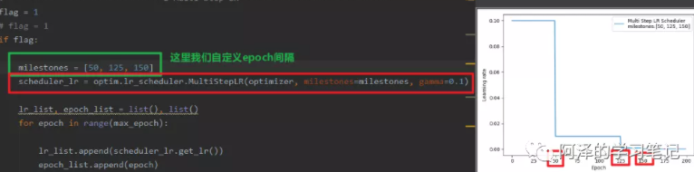

##### ExponentialLR 功能：按指数衰减调整学习率

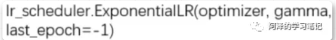

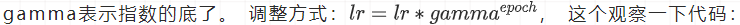

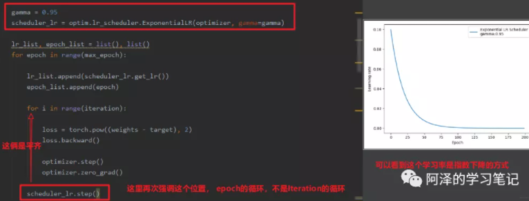

##### CosineAnnealingLR 功能：余弦周期调整学习率

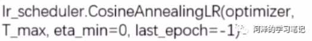

T_max表示下降周期，只是往下的那一块。eta_min表示学习率下限， 调整方式：

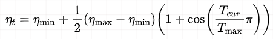

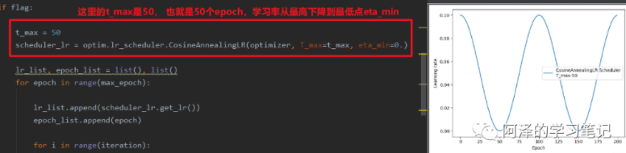

##### ReduceLRonPlateau 功能: 监控指标， 当指标不再变化则调整

**「这个非常实用」**。可以监控loss或者准确率，当不在变化的时候，我们再去调整。

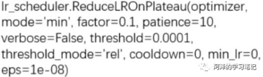

- mode: min/max两种模式（min就是监控指标不下降就调整，比如loss，max是监控指标不上升就调整， 比如acc）
- factor: 调整系数，类似上面的gamma
- patience: "耐心", 接受几次不变化， 这一定要是连续多少次不发生变化
- cooldown: "冷却时间", 停止监控一段时间
- verbose：是否打印日志， 也就是什么时候更新了我们的学习率
- min_lr: 学习率下限
- eps: 学习率衰减最小值

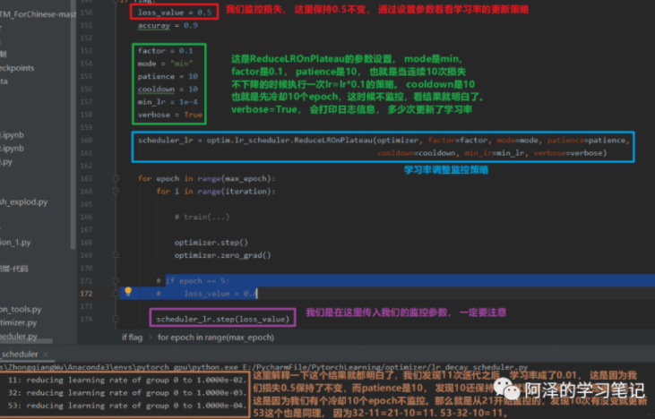

##### LambdaLR 功能：自定义调整策略

可以自定义我们的学习率更新策略，这个就是真的告诉程序我们想怎么改变学习率了。并且**「还可以对不同的参数组设置不同的学习率调整方法，所以在模型的finetune中非常实用」**。

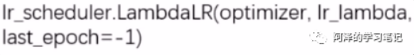

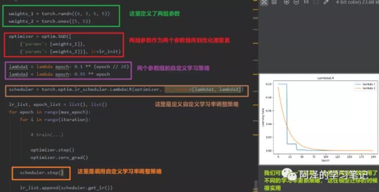

##### **小结**

1. 有序调整：Step、MultiStep、 Exponential和CosineAnnealing， 这些得事先知道学习率大体需要在多少个epoch之后调整的时候用
2. 自适应调整：ReduceLROnPleateau， 这个非常实用，可以监控某个参数，根据参数的变化情况自适应调整
3. 自定义调整：Lambda， 这个在模型的迁移中或者多个参数组不同学习策略的时候实用

##### **两种学习率初始化的方式：**

- 设置较小数：0.01， 0.001， 0.0001
- 搜索最大学习率：看论文《Cyclical Learning Rates for Training Neural Networks》, 这个就是先让学习率从0开始慢慢的增大，然后观察acc， 看看啥时候训练准确率开始下降了，就把初始学习率定为那个数。

# 4. 总结

优化器的基本属性和方法，并通过代码调试的方式了解了优化器的初始化和使用原理。然后学习了常用的优化器，介绍了两个非常关键的概念学习率和动量， 学习了SGD优化器。优化器中非常重要的一个参数就是学习率，在模型的训练过程中，对学习率调整非常关键，所以最后又学习了学习率的6种调整策略，从三个维度进行总结。