# 1.大纲

- 正则化之 weight_decay (正则化与偏差和方差， L2 正则化）
- 正则化之 Dropout（概念以及如何用）
- 标准化之 Batch Normalization
- Normalization-layers（Layer Normalization、Instance Normalization、Groupb Normalization）


# 2. 正则化之 weight_decay

减少方差的策略，有利于解决过拟合的问题

误差可分解为：偏差，方差与噪声之和。即误差 = 偏差 + 方差 + 噪声

- 偏差度量了学习算法的期望预测与真实结果的偏离程度， 即刻画了学习算法本身的拟合能力
- 方差度量了同样大小的训练集的变动所导致的学习性能的变化，即刻画了数据扰动所造成的影响
- 噪声则表达了在当前任务上任何学习算法所能达到的期望泛化误差的下界。


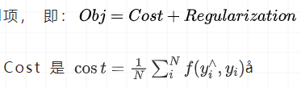

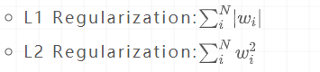

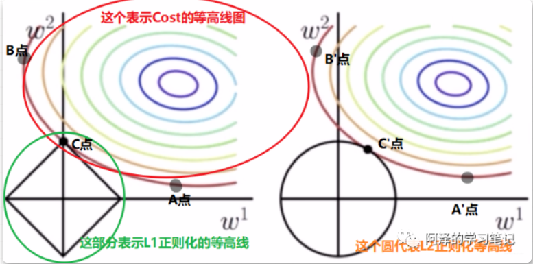

​				|w1| + |w2| = r															

L1 正则项一般会产生稀疏的解，也就是有 0 项的解。这是因为加上 L1 之后，我们参数的解往往会发生在坐标轴上导致某些参数的值为 0

L2 正则项的最优的参数值很小概率出现在坐标轴上，因此每一维的参数都不会是 0。当最小化 ||w|| 时，就会使每一项趋近于 0

### L1 正则化的特点：

- 不容易计算， 在零点连续但不可导， 需要分段求导
- L1 模型可以将 一些权值缩小到零（稀疏）
- 执行隐式变量选择。这意味着一些变量值对结果的影响降为 0， 就像删除它们一样
- 其中一些预测因子对应较大的权值， 而其余的（几乎归零）
- 由于它可以提供稀疏的解决方案， 因此通常是**建模特征数量巨大**时的首选模型
- 它任意选择高度相关特征中的任何一个，并将其余特征对应的系数减少到 0**
- L1 范数对于**异常值更具提抗力**

### L2 正则化的特点：

- 容易计算， 可导， 适合**基于梯度**的方法
- 将一些权值缩小到接近 0
- 相关的预测特征对应的系数值相似
- 当特征数量巨大时， 计算量会比较大
- 对于有相关特征存在的情况，它会包含所有这些相关的特征， 但是相关特征的权值分布取决于相关性。
- 对**异常值非常敏感**
- 相对于 L1 正则会更加**准确**


 L2 正则项又叫做 weight decay (权值衰减)

```python
optim_normal = torch.optim.SGD (net_normal.parameters (), lr=0.01, momentum=0.9)
optim_wdecay = torch.optim.SGD (net_weight_decay.parameters (), lr=0.01, momentum=0.9, weight_decay=1e-2)
```


# 3. 正则化之 Dropout

## **3.1 Dropout 概念**

Dropout 叫做随机失活。


减轻了一个过渡依赖的现象, 对特征少了依赖， 从而有利于缓解过拟合

测试的时候，所有权重都乘以 1-drop_prob， 以保证训练和测试时尺度变化一致， drop_prob 是我们的随机失活概率。

## **3.2 nn.Dropout**


p 就是被舍弃概率，也就是失活概率。

```python
net_prob_0 = MLP (neural_num=n_hidden, d_prob=0.)
net_prob_05 = MLP (neural_num=n_hidden, d_prob=0.5)
```

# 4. 标准化之 BN

##  4.1 BN 是什么以及为啥用？

BatchNormalization 就是批标准化， 批指的是 mini-batch, 标准化也就是 0 均值 1 方差

- 可以用更大学习率，加速模型收敛
- 可以不用精心设计权值初始化
- 可以不用 Dropout 或者较小的 Dropout
- 可以不用 L2 或者较小的 weight decay
- 可以不用局部响应标准化（AlexNet 中用到过）

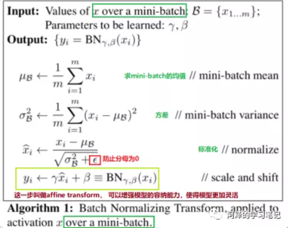

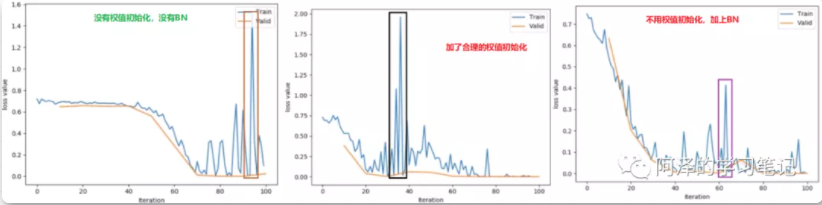

## **4.2 Pytorch 中的 BN**

Pytorch 中提供了三种 BatchNorm 方法：

- nn.BatchNorm1d
- nn.BatchNorm2d
- nn.BatchNorm3d 

上面三个 BatchNorm 方法都继承 `__BatchNorm` 这个基类


这里的 `num_features` 表示一个样本的特征数量，这是最重要的一个参数。`eps` 表示分母修正项， `momentum` 表示指数加权平均估计当前 mean/var。`affine` 表示是否需要 affine transform, `track_running_stats` 表示是训练状态还是测试状态


这四个属性分别对应我们公式中用到的四个属性：

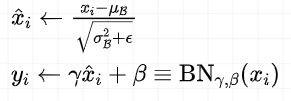

这里的均值和方差是采用指数加权平均进行计算的， 不仅要考虑当前 mini-batch 的均值和方差，还考虑上一个 mini-batch 的均值和方差（当然是在训练的时候，测试的时候是用当前的统计值。）

```python
running_mean = (1-momentum) * pre_running_mean + momentum*mean_t
running_var = (1-momentum) * pre_running_var + momentum * var_t
```

### 区别

1 nn.BatchNorm1d ->  input = B * 特征数 * 1d 特征

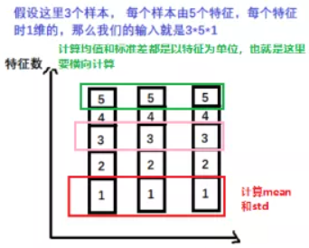

```python
batch_size = 3    # 3 个样本
num_features = 5    # 5 个特征
momentum = 0.3     # 这个计算后面均值，方差的时候用到

features_shape = (1)   # 我们特征的维度是 1

feature_map = torch.ones (features_shape)                                                    # 1D   一个特征
feature_maps = torch.stack ([feature_map*(i+1) for i in range (num_features)], dim=0)         # 2D   一列数据
feature_maps_bs = torch.stack ([feature_maps for i in range (batch_size)], dim=0)             # 3D   上面那 3 列数据
print ("input data:\n {} shape is {}".format (feature_maps_bs, feature_maps_bs.shape))

bn = nn.BatchNorm1d (num_features=num_features, momentum=momentum)   # BN1d 在这里定义

running_mean, running_var = 0, 1   # 这个得初始化，毕竟我们这是第一次迭代

for i in range (2):
  outputs = bn (feature_maps_bs)

  print ("\niteration:{}, running mean: {}".format (i, bn.running_mean))
  print ("iteration:{}, running var:{}".format (i, bn.running_var))

  mean_t, var_t = 2, 0

  running_mean = (1 - momentum) * running_mean + momentum * mean_t         # 采用滑动平均方式计算均值和方差
  running_var = (1 - momentum) * running_var + momentum * var_t

  print ("iteration:{}, 第二个特征的 running mean: {}".format (i, running_mean))
  print ("iteration:{}, 第二个特征的 running var:{}".format (i, running_var))
```

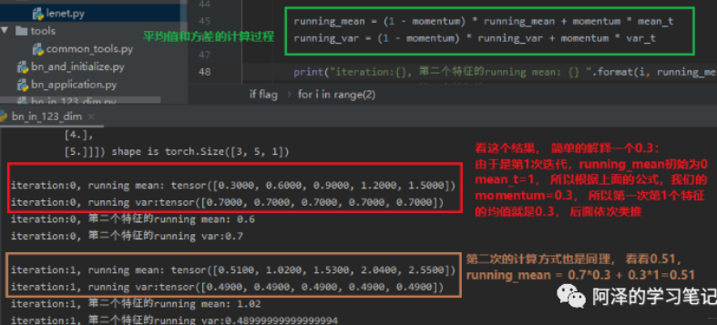

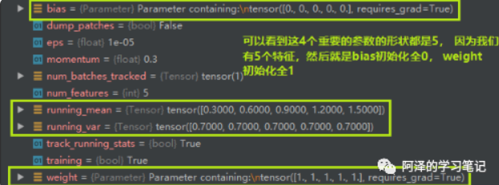

2 nn.BatchNorm2d -> input = B * 特征数 * 2d 特征

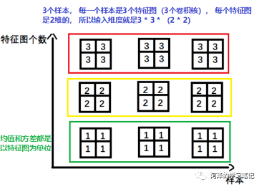

卷积图像中经常是这种 2d 的。

3 nn.BatchNorm3d -> input = B * 特征数 * 3d 特征


这个在时空序列中会用到。


## **4.3 其他的 Normalization 方法**

Normalization 方法其实有四种，分别是 Batch Normalization (BN)、Layer Normalization (LN)、Instance Normalization (IN)、Group Normalization (GN)。

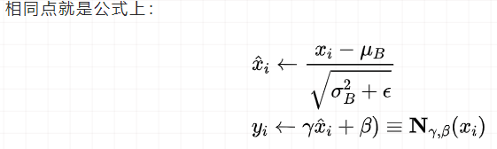

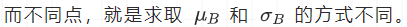

- **BatchNormalization** 我们上面已经学习了，这个是在一个 **batch** 上去计算均值和方差
- **Layer Normalization** 是以**层**为单位去计算均值和方差
- **Instance Normalization** 主要在**图像生成方法**中使用的一个方法
- **Group Normalization** 是按**组**为单位计算均值和方差

### **「1 Layer Normalization」**

起因：BN 不适用于变长的网络，如 RNN， 所以提出了逐层计算均值和方差的思路。

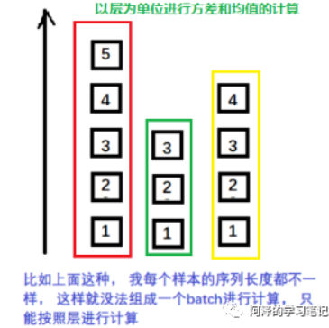

BN 与 LN 的区别：

- LN 中同层神经元输入拥有相同的均值和方差，不同的输入样本有不同的均值和方差；
- BN 中则针对不同神经元输入计算均值和方差，同一个 batch 中的输入拥有相同的均值和方差。

还要注意， 在 LN 中不再有 running_mean 和 running_var， 并且 gamma 和 beta 为逐元素的。下面我们看看 Pytorch 中的 LN：

```python
nn.LayerNorm (normalized_shape, eps=1e-05, elementwise_affine=True)
```

- `normalized_shape` 表示该层特征形状
- `eps`表示分母修正项
-  `elementwise_affine` 表示是否需要 affine transform

LayerNorm 常用在 RNN 当中，在 CNN 和 FCN 中不如 BN 的效果好。

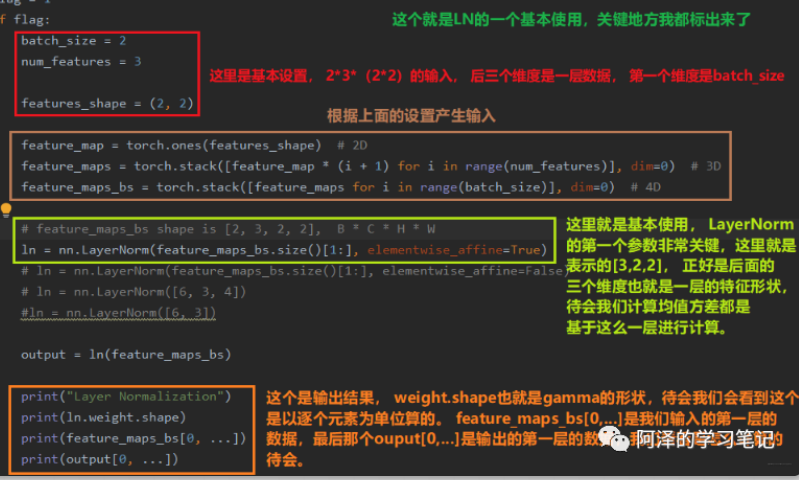

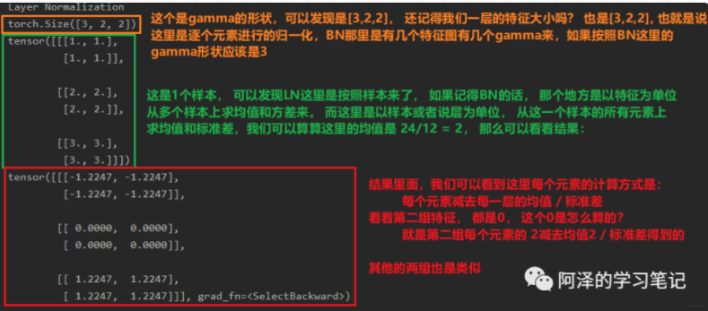

### **「2 Instance Normalization」**

起因：BN 在图像生成中不适用， 思路就是逐个 Instance(channel) 计算均值和方差。  **图像风格迁移**

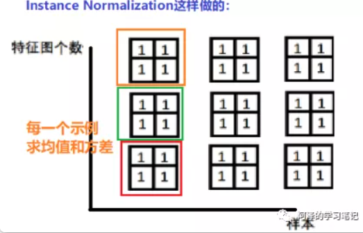

```python
nn.InstanceNorm2d (num_features, eps=1e-05, momentum=0.1, affine=False, track_running_stats=False)
```

- `num_features` 表示一个样本的特征数量 (最重要)
- `eps` 表示分母修正项
- `momentum` 指数加权平均估计当前的 mean/var
- `affine` 是否需要 affine transform
- `track_running_stats` 表示训练状态还是测试状态

**「3 Group Normalization」**

起因：小 batch 样本中， BN 估计的值不准， 这种 Normalization 的思路就是数据不够， 通道来凑。一样用于大模型（小 batch size）的任务。

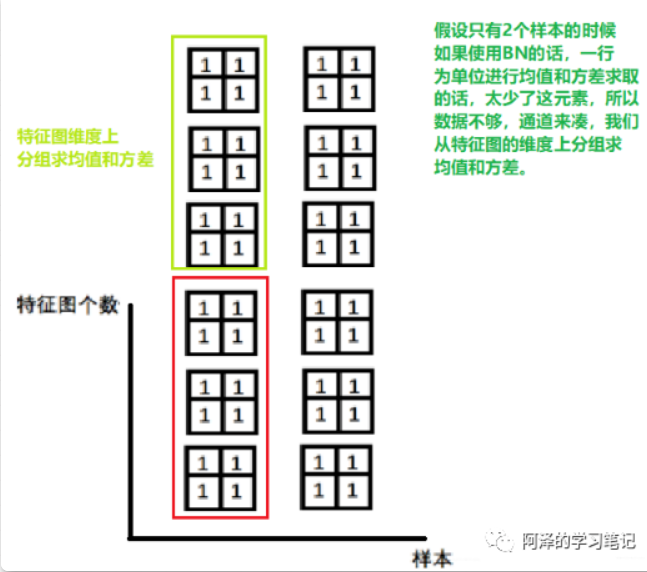

```python
nn.GroupNorm (num_groups, num_channels, eps=1e-05, affine=True)
```

- `num_groups` 表示分组数
- `num_channels` 表示通道数（特征数）
- `eps` 表示分母修正项
- `affine` 是否需要 affine transform

前两个参数是必须的，要不然机器也不知道你要咋分组，每组多少个等。提供了组数和通道数，两者的商就代表一组是多少个特征图， 这样从一组中求平均和方差。还要注意分组的时候要能整除。

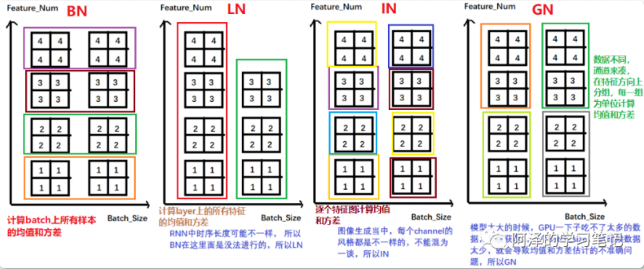

# 5. 总结

总结了一下 Pytorch 中常用的正则化和标准化的一些方法

正则化那块，正则化主要是缓解模型的过拟合问题，我们从 L2 正则化开始，L2 正则化也叫权重衰减，我们学习了 L2 正则的原理，L1 正则和 L2 正则的区别，然后学习了 L2 正则在 Pytorch 中的使用。 然后又学习了 Dropout 正则化，依然是原理和使用，并且对比了一下 L2 正则和 Dropout 正则的效果。

标准化主要是解决网络层输出的数据尺度变化不一致的问题， 首先学习了 Batch Normalization，这个非常重要，有很多的优点， 学习了它的原理和具体的使用方法，然后又介绍了其他三种标准化方法， LayerNorm Normalization、Instance Normalization 和 Group Normalization， 分别看了一下是如何计算的并且在 Pytorch 中如何使用的。最后对比了一下这四种方法。

