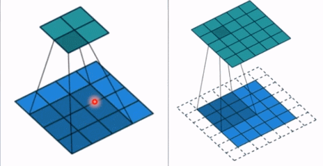

# 1.大纲

- 卷积运算与卷积层(1/2/3d卷积， nn.Conv2d, nn.ConvTranspose)
- 池化运算与池化层(最大池化和平均池化）
- 全连接层
- 非线性激活函数层
- 总结梳理


# 2.卷积运算与卷积层

## **2.1 1d 2d 3d 卷积示意**

## **2.2 nn.Conv2d**

`nn.Conv2d`: 对多个二维信号进行二维卷积


主要参数：

- in_channels: 输入通道数
- out_channels: 输出通道数， 等价于卷积核个数
- kernel_size: 卷积核尺寸， 这个代表着卷积核的大小
- stride: 步长， 这个指的卷积核滑动的时候，每一次滑动几个像素。下面看个动图来理解步长的概念：左边那个的步长是 1， 每一次滑动 1 个像素，而右边的步长是 2，会发现每一次滑动 2个像素。

- padding: 填充个数，通常用来保持输入和输出图像的一个尺寸的匹配，依然是一个动图展示，看左边那个图，这个是没有 padding 的卷积，输入图像是 4 * 4，经过卷积之后，输出图像就变成了 2 * 2 的了，这样分辨率会遍变低，并且我们会发现这种情况卷积的时候边缘部分的像素参与计算的机会比较少。所以加入考虑 padding 的填充方式，这个也比较简单，就是在原输入周围加入像素，这样就可以保证输出的图像尺寸分辨率和输入的一样，并且边缘部分的像素也受到同等的关注了。



- dilation: 孔洞卷积大小，孔洞卷积就可以理解成一个带孔的卷积核，常用于图像分割任务，主要功能就是提高感受野。也就是输出图像的一个参数，能看到前面图像更大的一个区域。

- groups: 分组卷积设置，分组卷积常用于模型的轻量化。我们之前的 AlexNet 其实就可以看到分组的身影， 两组卷积分别进行提取，最后合并。
- bias: 偏置

下面是尺寸计算的方式：

在几个维度滑动就是几维卷积，有几个卷积核得到几个张量

## **2.3 转置卷积**

转置卷积又称为反卷积和部分跨越卷积。用于对图像进行上采样


转置卷积是一个上采样，输入的图像尺寸是比较小的，经过转置卷积之后，会输出一个更大的图像

`nn.ConvTranspose2d`: 转置卷积实现上采样


转置卷积有个通病叫做“棋盘效应”


```python
卷积前尺寸:torch.Size([1, 3, 512, 512])
卷积后尺寸:torch.Size([1, 1, 1025, 1025])
```

# 3.池化层

池化运算：对信号进行“**「收集」**”并“**「总结」**”

- 收集：多变少，图像的尺寸由大变小
- 总结：最大值/平均值

### nn.MaxPool2d

nn.MaxPool2d: 对二维信号(图像）进行最大值池化。


- kernel_size: 池化核尺寸
- stride: 步长
- padding: 填充个数
- dilation: 池化核间隔大小
- ceil_mode: 尺寸向上取整
- return_indices: 记录池化像素索引

最后一个参数常在最大值反池化的时候使用，反池化就是将尺寸较小的图片通过上采样得到尺寸较大的图片。需要当时**最大值池化记录的索引**了。用来记录最大值池化时候元素的位置，然后在最大值反池化的时候把元素放回去。

### nn.AvgPool2d

nn.AvgPool2d: 对二维信号(图像)进行平均值池化


- count_include_pad: 填充值用于计算
- divisor_override: 除法因子， 这个是求平均的时候那个分母，默认是有几个数相加就除以几，当然也可以自己通过这个参数设定

与最大池化区别：最大池化的亮度会稍微亮一些

### nn.MaxUnpool2d 反池化


对二维信号(图像)进行最大池化上采样

与池化层区别：前向传播的时候我们需要传进一个 indices

# 4.线性层

线性层又称为全连接层，其每个神经元与上一层所有神经元相连实现对前一层的**「线性组合，线性变换」**

### nn.linear()

nn.Linear(in_features, out_features, bias=True):对一维信号（向量）进行线性组合

- in_features: 输入节点数
- out_features: 输出节点数
- bias: 是否需要偏置


```python
inputs = torch.tensor([[1., 2, 3]])
linear_layer = nn.Linear(3, 4)
linear_layer.weight.data = torch.tensor([[1., 1., 1.],
                                             [2., 2., 2.],
                                             [3., 3., 3.],
                                             [4., 4., 4.]])

linear_layer.bias.data.fill_(0.5)
output = linear_layer(inputs)
print(inputs, inputs.shape)
print(linear_layer.weight.data, linear_layer.weight.data.shape)
print(output, output.shape)
```

# 5.激活函数层

激活函数 Udine 特征进行非线性变换， 赋予多层神经网络具有**「深度」**的意义。


# 6.总结

1.学习各个子模块的使用。从比较重要的卷积层开始，学习了1d 2d 3d 卷积到底在干什么事情。二维卷积运算及转置卷积运算

2.池化运算和池化层的学习，全连接层，非线性激活函数

