# 1.大纲

- Tensorboard 的简介与安装
- Tensorboard 的基本使用（标量可视化和图像可视化）
- hook 函数与 CAM 可视化

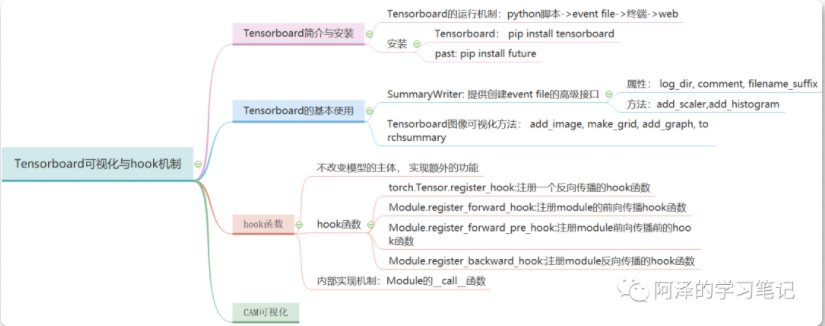

# 2. Tensorboard 的简介与安装

```python
import numpy as np
from torch.utils.tensorboard import SummaryWriter


writer = SummaryWriter(comment='test_tensorboard')

for x in range(100):

    writer.add_scalar('y=2x', x * 2, x)
    writer.add_scalar('y=pow(2, x)',  2 ** x, x)
    
    writer.add_scalars('data/scalar_group', {"xsinx": x * np.sin(x),
                                             "xcosx": x * np.cos(x),
                                             "arctanx": np.arctan(x)}, x)
writer.close()
```

`tensorboard --logdir=./runs`

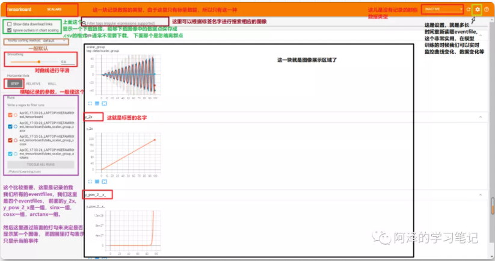

# 3. Tensorboard 的基本使用

## **3.1 SummaryWriter**

这个类的功能是提供创建 event file 的高级接口。

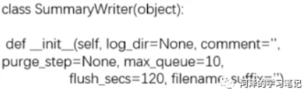

- log_dir：event file 输出文件夹，如果不设置的话，就会创建一个 runs，通常自己设置
- comment：不指定 log_dir 时，文件夹后缀
- filename_suffix：event file 文件名后缀

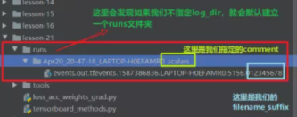

指定 log_dir，就会发现此时 comment 就不起作用了：

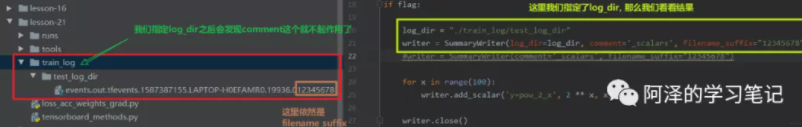

### **「1 add_scaler()/add_scalers()」**功能：记录标量

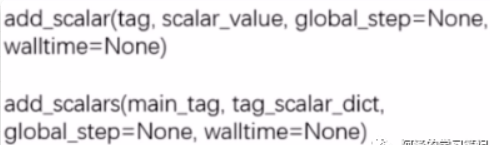

tag 表示图像的标签名，图的唯一标识，就是图的标题。scaler_value 表示要记录的标量，可以理解为 y 轴，global_step 表示 x 轴。

**局限性**就是它只能画一条线，但是往往模型训练的时候想监控训练集和验证集的曲线的对比情况，那时候这个不能使了。可以用 add_scalers()，这里面两个参数：

- main_tag: 该图的标签
- tag_scaler_dict: key 是变量的 tag（类似于每条曲线的标签），value 是变量的值（等用于上面的scaler_value，只不过是可以多个线）

### **「2 add_histogram()」**功能：统计直方图与多分位数直线图

 这对参数的分布以及梯度的分布非常有用

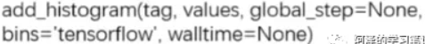

tag 表示图像的标签名，图的唯一标识；values 表示要统计的参数，global_step 表示y轴，bins 表示取直方图的 bins。

### 实战

正确率变化曲线以及参数的分布及它们权重的一个分布：

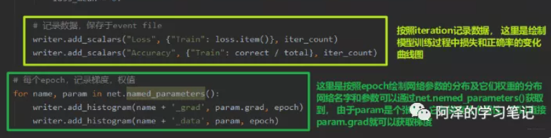

验证集上的损失和正确率的曲线变化图像：

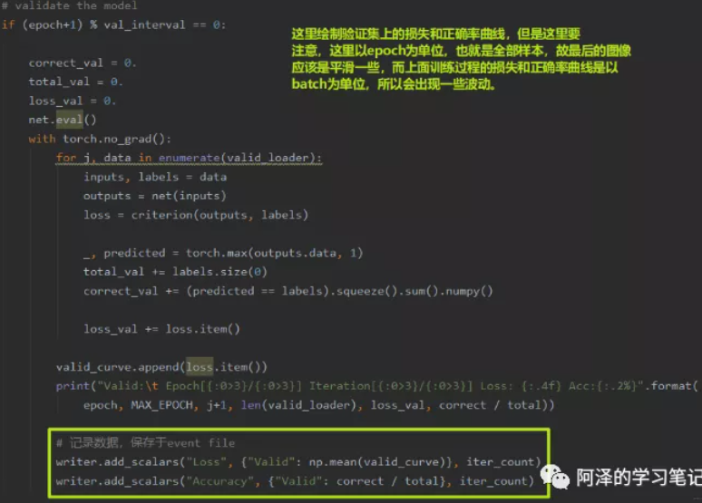

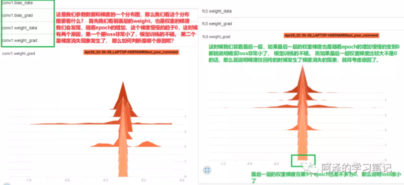

## **3.2 Tensorboard 图像可视化方法**

### **「1 add_image()」**功能：记录图像

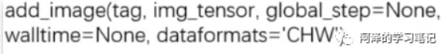

- tag表示图像的标签名，图的唯一标识。
- img_tensor这个要注意，表示的我们图像数据，但是要**「注意尺度」**， 如果我们的图片像素值都是0-1， 那么会默认在这个基础上*255来可视化，毕竟我们的图片都是0-255， 如果像素值有大于1的，那么机器就以为是0-255的范围了，不做任何改动。
- global_step: x轴
- dataformats: 数据形式，有 CHW，HWC，HW（灰度图）

```python
writer = SummaryWriter(comment='test_your_comment', filename_suffix="_test_your_filename_suffix")

# img 1     random
fake_img = torch.randn(3, 512, 512) # CHW
writer.add_image("fake_img", fake_img, 1)
time.sleep(1)

# img 2     ones
fake_img = torch.ones(3, 512, 512)   # 这个全1， 没有大于1的，所以机器会先乘以255然后显示
time.sleep(1)
writer.add_image("fake_img", fake_img, 2)

# img 3     1.1
fake_img = torch.ones(3, 512, 512) * 1.1    # 这个像素都大于1， 所以默认不处理
time.sleep(1)
writer.add_image("fake_img", fake_img, 3)

# img 4     HW
fake_img = torch.rand(512, 512)  # 灰度图像
writer.add_image("fake_img", fake_img, 4, dataformats="HW")

# img 5     HWC
fake_img = torch.rand(512, 512, 3)    # 演示一下dataformats
writer.add_image("fake_img", fake_img, 5, dataformats="HWC")

writer.close()
```

没法同时对比

### **「2 torchvision.utils.make_grid」**功能：制作网格图像

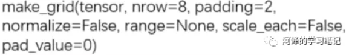

- tensor: 图像数据， B**C**H*W的形式， B表示图片个数
- nrow: 行数（列数自动计算）， 这个是根据上面指定的B来计算列数
- padding：图像间距（像素单位）
- normalize: 是否将像素值标准化， 这里的标准化可不是平时那种，我们视觉像素一般是0-255， 所以如果我们的像素值是0-1的数了，将这个设置为True，就会把像素值映射到0-255之间，设置为False，就不变。所以这里的标准化是针对视觉像素正常范围来讲。
- range：标准化范围，有时候我们可以舍弃掉一些过大或者过小的像素。比如我们一张图片像素值范围是[-1000,2000]， 如果我们指定这里的标准化范围是[-600, 500], 那么就会先把图片像素值规范到这个指定区间，小于-600的统一-600表示，大于500的统一500表示。然后再进行标准化到0-255.
- scale_each: 是否单张图维度标准化（因为有的图像可能尺度都不一样，如果设置False，是从整个大张量上进行标准化）
- pad_value: padding的像素值（网格线的颜色，通常默认0）

```python
 writer = SummaryWriter(comment='test_your_comment', filename_suffix="_test_your_filename_suffix")

    split_dir = os.path.join("..", "05数据读取机制", "data", "rmb_split")
    train_dir = os.path.join(split_dir, "train")
    # train_dir = "path to your training data"

    transform_compose = transforms.Compose([transforms.Resize((32, 64)), transforms.ToTensor()])
    train_data = RMBDataset(data_dir=train_dir, transform=transform_compose)
    train_loader = DataLoader(dataset=train_data, batch_size=16, shuffle=True)
    data_batch, label_batch = next(iter(train_loader))

    img_grid = vutils.make_grid(data_batch, nrow=4, normalize=True, scale_each=True)
    # img_grid = vutils.make_grid(data_batch, nrow=4, normalize=False, scale_each=False)
    writer.add_image("input img", img_grid, 0)

    writer.close()
```

add_image结合make_grid的使用方法还是比较实用的，我们可以对我们的数据进行一个基本的审查，快速的检查训练数据样本之间是否有交叉，这些样本的标签是否是正确的。这样审查数据集就比较快了。

### **「3 add_graph()」**功能：可视化模型计算图

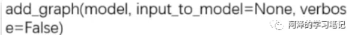

- model: 模型，必须时nn.Module
- input_to_model: 输出给模型的数据
- verbose: 是否打印计算图结构信息


```python
writer = SummaryWriter(comment='test_your_comment', filename_suffix="_test_your_filename_suffix")

# 模型
fake_img = torch.randn(1, 3, 32, 32)

lenet = LeNet(classes=2)

writer.add_graph(lenet, fake_img)  # 这是可视化LeNet的计算图

writer.close()
```

### **「4 torchsummary」**功能：查看模型信息

便于调试, 打印模型输入输出的shape以及参数总量

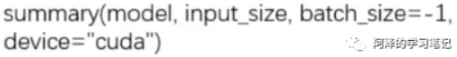

- model: pytorch模型
- input_size: 模型输入size
- batch_size: batch size
- device: "cuda" or "cpu"， 通常选CPU

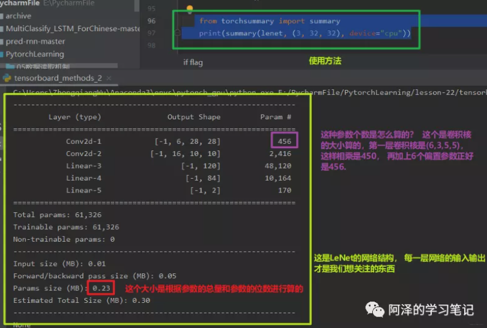

# 4. hook 函数与 CAM 可视化

## **4.1 hook 函数介绍**

Hook 函数机制：不改变模型的主体，实现额外功能，像一个挂件和挂钩。

通过这个额外的函数去获取这些可能被释放掉而我们后面又想用的这些中间变量， 甚至可以通过hook函数去改变中间变量的梯度。

Pytorch 提供了四种 hook 函数：

1. torch.Tensor.register_hook(hook): 针对tensor
2. torch.nn.Module.register_forward_hook：后面这三个针对Module
3. torch.nn.Module.register_forward_pre_hook
4. torch.nn.Module.register_backward_hook

## **4.2 hook 函数与特征图提取**

### **「1 torch.Tensor.register_hook」**

**作用**：注册一个**「反向传播」**的hook函数

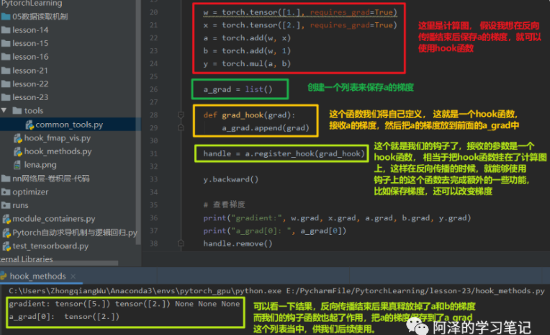

修改叶子节点W的梯度

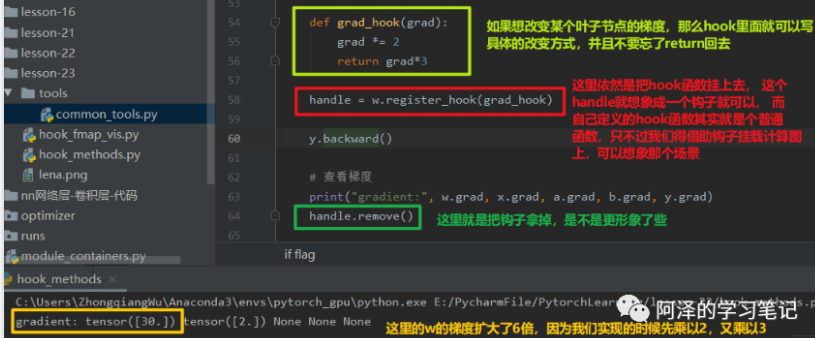

### **「2 Module.register_forward_hook」**

**功能**：注册module的前向传播hook函数


允许挂的函数有3个输入，module表示当前网络层， input表示当前网络层的输入数据， output表示当前网络层的输出数据。通常使用这个函数在前向传播过程中获取卷积输出的一个特征图。

### **「3 Module.register_forward_pre_hook」**

**功能**：注册module前向传播**「前」**的hook函数，允许挂的函数结构：


它是挂在前向传播前的函数，所以这里的接收参数就没有output了。这个功能可以查看我们网络之前的数据。

### **「4 Module.register_backward_hook」**

**功能**：注册module反向传播的hook函数


由于是挂在了反向传播后，所以当前的输入有三个参数，并且后两个是grad_input和grad_out， 当前网络层输入梯度数据和输出梯度数据。

```python
## 定义我们的网络， 这里只有卷积核池化两个操作
class Net(nn.Module):
 def __init__(self):
  super(Net, self).__init__()
  self.conv1 = nn.Conv2d(1, 2, 3)  # 1张图片， 2个卷积核， 3*3的
  self.pool1 = nn.MaxPool2d(2,2)
 
 def forward(self, x):
  x = self.conv1(x)
  x = self.pool1(x)
  return x

## 下面定义前向传播的hook函数
def forward_hook(module, data_input, data_output):
 fmap_block.append(data_output)
 input_block.append(data_input)

## 网络初始化
net = Net()
# 按照上面的图进行卷积层的网络初始化
net.conv1.weight[0].detach().fill_(1)
net.conv1.weight[1].detach().fill_(2)
net.conv1.bias.data.detach().zero_()

## 弄一个钩子挂上函数
fmap_block = list()   # 保存特征图
input_block = list()
net.conv1.register_forward_hook(forward_hook)   # 这句话就把函数用钩子挂在了conv1上面，进行conv1输出的获取

## 下面初始化一个输入
fake_img = torch.ones((1, 1, 4, 4))   # 根据上面图片初始化
output = net(fake_img)   # 前向传播

# 先不用反向传播，我们输出特征图看看
print("output shape: {}\noutput value: {}\n".format(output.shape, output))
print("feature maps shape: {}\noutput value: {}\n".format(fmap_block[0].shape, fmap_block[0]))
print("input shape: {}\ninput value: {}".format(input_block[0][0].shape, input_block[0])) 
```

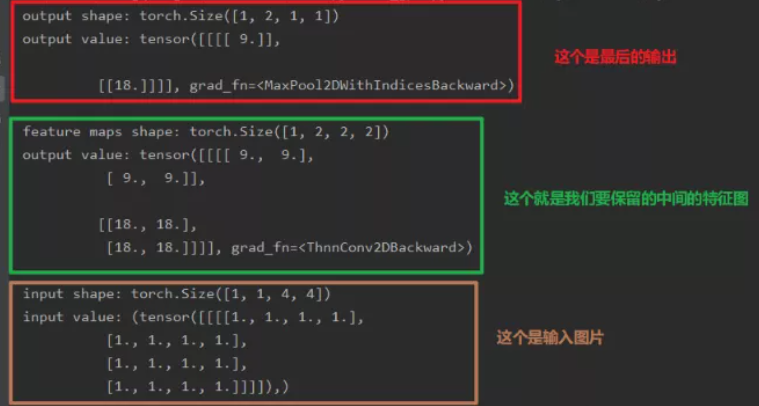


在模型调用的时候，其实是在执行Module的`__call__`函数，**「这个函数其实是完成4部分的工作」**，首先是前向传播之前的hook函数，然后才是前向传播的函数， 之后是forward_hooks函数， 最后是反向传播的hooks函数。这个就是Pytorch中hook函数的一个运行机制了。

hook机制，是在计算图上挂一些钩子，然后钩子上挂一些函数，在不改变模型或者计算图的主体下，实现了一些额外的功能，比如保存一些中间变量等。

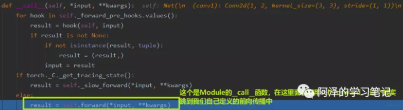

## **4.3 CAM 可视化**

CAM：类激活图， class activation map。分析卷积神经网络,分析我们的网络是关注图像的哪些部分而得到的这个结果

CAM的基本思想：它会对网络的最后一个特征图进行加权求和，就可以得到一个注意力机制，就是卷积神经网络更关注于什么地方

# 5. 总结

首先我们学习了Tensorboard的安装与使用方法， 见识了Tensorboard的强大可视化功能，学习了对于标量的可视化，尤其是绘制模型的学习曲线，这个还是非常重要的，因为学习曲线这个东西可以看出模型究竟是过拟合还是欠拟合的问题。

然后学习了图像的可视化方式，add_graph, add_image,还有make_grid等 函数。add_image结合make_grid的使用方法还是比较实用的，可以帮助我们更好的去审查输入数据。

第二块介绍了hook机制，这个是Pytorch中留给我们扩展功能的一些接口，在不改变网络的主体下额外增加功能。主要有四种hook函数， 并且学习了内部的运行机制。最后了解了一下CAM可视化的东西