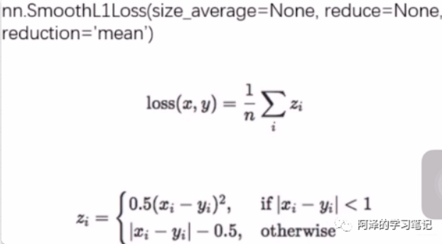

# 1.大纲

- 权值初始化（梯度消失与爆炸，Xavier 方法与 Kaiming 方法，十种初识化方法）
- 损失函数（损失函数，代价函数，目标函数这哥仨不是一回事，交叉熵损失，NLL/BCE/BCEWithLogits Loss）
- 总结梳理


# 2.权值初始化

##  2.1 梯度的消失和爆炸

梯度连乘非常小或非常大的数，反向传播权重无法更新


发现W~2~梯度的求解过程中会用到上一层神经元的输出值H~1~ ，那么这时候，如果 的输出值非常小，那么 的梯度也会非常小


*把权重方差改了*

```python
nn.init.normal_(m.weight.data, std=np.sqrt(1/self.neural_num)) 
nn.init.kaiming_normal_(m.weight.data)
```

##  2.2 Xavier初始化

**「方差一致性」**：保持数据尺度范围维持在恰当范围，通常方差为 1。

**「考虑的是饱和激活函数」**

```python
def initialize(self):
  for m in self.modules():
    if isinstance(m, nn.Linear):
      # Xavier初始化权重
      tanh_gain = nn.init.calculate_gain('tanh')
      nn.init.xavier_uniform_(m.weight.data, gain=tanh_gain)
```

`nn.init.calculate_gain(nonlinearity, param=None)`计算激活函数的**「方差变化尺度」**

输入数据的方差除以经过激活函数之后的输出数据的方差。

- nonlinearity 表示激活函数的名称，如`tanh`。
- param 表示激活函数的参数，如 Leaky ReLU 的`negative_slop`。

**「所以Xavier权重初始化，有利于缓解带有sigmoid，tanh的这样的饱和激活函数的神经网络的梯度消失和爆炸现象。」**  对非饱和函数不好使

##  2.3 Kaiming 初始化

方差一致性原则，**「针对的激活函数是 ReLU 及其变种」**

```python
def initialize(self):
  for m in self.modules():
    if isinstance(m, nn.Linear):
      nn.init.kaiming_normal_(m.weight.data)
      # nn.init.normal_(m.weight.data, std=np.sqrt(2 / self.neural_num))     # 这两句话其实作用一样，不过自己写还得计算出标准差
```

##  2.4 十种权重初始化方法

- 针对饱和激活函数（sigmoid， tanh）：Xavier 均匀分布，Xavier 正态分布
- 针对非饱和激活函数（relu 及变种）：Kaiming 均匀分布，Kaiming 正态分布
- 三个常用的分布初始化方法：均匀分布，正态分布，常数分布
- 三个特殊的矩阵初始化方法：正交矩阵初始化，单位矩阵初始化，稀疏矩阵初始化

# 3.损失函数

##  3.1 损失函数初步介绍

损失函数：衡量模型输出与真实标签的差异。


损失函数其实也是一个 Module,定义在了 forward 函数中。

## **3.2 交叉熵损失 CrossEntropyLoss**

### nn.CrossEntropyLoss

nn.LogSortmax() 与 nn.NLLLoss() 结合，进行交叉熵计算。


- weight：各类别的 loss 设置权值
- ignore_index：忽略某个类别
- reduction：计算模式，可为 none/sum/mean，none 表示逐个元素计算，这样有多少个样本就会返回多少个 loss。sum 表示所有元素的 loss 求和，返回标量，mean 所有元素的 loss 求加权平均（加权平均的含义下面会提到），返回标量。看了下面的原理就懂了。

自信息，概率是 0.5 的时候熵最大，也就是事件的不确定性最大，熵大约是 0.69


相对熵又称为 KL 散度，用来衡量两个分布之间的差异，也就是两个分布之间的距离，但是不是一个距离函数，因为距离函数有对称性，也就是 p 到 q 的距离等于 q 到 p 的距离。

**「交叉熵=信息熵+相对熵」**交叉熵是衡量两个分布之间的距离，一个差异。使用 softmax，就可以将一个输出值转换到概率取值的一个范围。

最小化交叉熵，其实就是最小化相对熵

```python
# fake data
inputs = torch.tensor([[1, 2], [1, 3], [1, 3]], dtype=torch.float)  # 这里就是模型预测的输出， 这里是两个类，可以看到模型输出是数值，我们得softmax一下转成分布
target = torch.tensor([0, 1, 1], dtype=torch.long)  # 这里的类型必须是long， 两个类0和1

# 三种模式的损失函数
loss_f_none = nn.CrossEntropyLoss(weight=None, reduction='none')
loss_f_sum = nn.CrossEntropyLoss(weight=None, reduction='sum')
loss_f_mean = nn.CrossEntropyLoss(weight=None, reduction='mean')

# forward
loss_none = loss_f_none(inputs, target)
loss_sum = loss_f_sum(inputs, target)
loss_mean = loss_f_mean(inputs, target)

# view
print("Cross Entropy Loss:\n ", loss_none, loss_sum, loss_mean)

## 结果：
Cross Entropy Loss:
  tensor([1.3133, 0.1269, 0.1269]) tensor(1.5671) tensor(0.5224)
```

**target，「这个是每个样本给出属于哪一个类即可，类型是 torch.long, 为什么要强调这个，我们下面会学习二分类交叉熵损失，是交叉熵损失函数的特例，那里的 target 更要注意，对比起来更容易理解」**


**加上weight，「mean 模式下求平均不是除以样本的个数，而是样本所占的权值的总份数」**

## 3.2.1 还有几个交叉熵损失函数的特例

#### **「1 nn.NLLoss」**

实现负对数似然函数里面的负号功能


#### **「2 nn.BCELoss」**

这个是交叉熵损失函数的特例，二分类交叉熵。注意：输入值取值在 [0,1]


#### **「3 nn.BCEWithLogitsLoss」**

结合了 Sigmoid 与二分类交叉熵    注意事项：网络最后不加sigmoid函数


`pow_weight`, 这个是平衡正负样本的权值用的， 对正样本进行一个权值设定。

正样本有 100 个，负样本有 300 个，那么这个数可以设置为 3，在类别不平衡的时候可以用。


##  3.3 剩余的 14 种损失函数介绍

#### **「1 nn.L1Loss」**

这个用于**回归**问题，用来计算inputs与target之差的绝对值


上面的 size_average 和 reduce 不用再关注，即将淘汰。而 reduction 这个三种模式，其实和上面的一样。

#### **「2 nn.MSE」**

这个也是用于**回归**问题，计算inputs与target之差的平方


#### **「3 nn.SmoothL1Loss」**

这是平滑的L1Loss（回归问题）



平滑实现


#### **「4 nn.PoissonNLLLoss」**

功能：泊松分布的负对数似然损失函数，分类里面如果发现数据的类别服从泊松分布，可以使用这个损失函数


#### **「5 nn.KLDivLoss」**

功能：计算 KLD， KL 散度，相对熵，注意：需要提前将输入计算 log-probabilities，如通过 nn.logsoftmax()


上面的 Pytorch 里面的计算和我们原来公式里面的计算还有点不太一样，所以我们得自己先 logsoftmax()，完成转换为分布然后转成对数才可以。这里的 reduction 还多了一种计算模式叫做 batchmean，是按照 batchsize 的大小求平均值。

#### **「6 nn.MarginRankingLoss」**

功能：计算两个向量之间的相似度，用于排序任务。特别说明，该方法计算两组数据之间的差异，也就是每个元素两两之间都会计算差异，返回一个 n*n 的 loss 矩阵。类似于相关性矩阵那种。


margin 表示边界值，x1 与 x2 之间的差异值。这里的计算公式如下：


#### **「7 nn.MultiLabelMarginLoss」**

功能：多标签边界损失函数， 这是一个多标签分类，就是一个样本可能属于多个类，和多分类任务还不一样。（多标签问题）


希望**「标签所在的神经元要比非标签所在的神经元的输出值要尽量的大」**，当这个差大于 1 了， 我们根据`max(0, 1-差值)`, 才发现不会有损失产生， 当这个差值小或者非标签所在的神经元比标签所在神经元大的时候，都会产生损失。

#### **「8 nn.SoftMarginLoss」**

功能：计算二分类的 logistic 损失（二分类问题）


#### **「9 nn.MultiLabelSortMarginLoss」**

功能：SoftMarginLoss 多标签版本 （多标签问题）


#### **「10 nn.MultiMarginLoss（hingLoss）」**

功能：计算多分类的折页损失（多分类问题）


#### **「11 nn.TripletMarginLoss」**

功能：计算三元组损失，人脸验证中常用


三元组在做这么个事情， 我们在做人脸识别训练模型的时候，往往需要把训练集做成三元组 (A, P, N)， A 和 P 是同一个人，A 和 N 不是同一个，然后训练我们的模型


#### **「12 nn.HingeEmbeddingLoss」**

功能：算两个输入的相似性，常用于非线性 embedding 和半监督学习。特别注意，输入的x应为两个输入之差的绝对值， 也就是手动计算两个输入的差值


#### **「13 nn.CosineEmbeddingLoss」**

功能：采用余弦相似度计算两个输入的相似性，常用于半监督学习和 embedding


#### **「14 nn.CTCLoss」**

功能：计算 CTC 损失， 解决时序类数据的分类


blank: blank label, zeor_infinity: 无穷大的值或者梯度置 0，这个使用起来比较复杂，所以具体的可以看看官方文档。

- **「分类问题」**

- - **「二分类单标签问题」**：`nn.BCELoss`, `nn.BCEWithLogitsLoss`, `nn.SoftMarginLoss`
  - **「二分类多标签问题」**：`nn.MultiLabelSoftMarginLoss`
  - **「多分类单标签问题」**: `nn.CrossEntropyLoss`, `nn.NLLLoss`, `nn.MultiMarginLoss`
  - **「多分类多标签问题」**: `nn.MultiLabelMarginLoss`,
  - **「不常用」**：`nn.PoissonNLLLoss`, `nn.KLDivLoss`

- **「回归问题」**: `nn.L1Loss`, `nn.MSELoss`, `nn.SmoothL1Loss`

- **「时序问题」**：`nn.CTCLoss`

- **「人脸识别问题」**：`nn.TripletMarginLoss`

- **「半监督Embedding问题(输入之间的相似性)」**: `nn.MarginRankingLoss`, `nn.HingeEmbeddingLoss`, `nn.CosineEmbeddingLoss`

# 4.总结

权重初始化和损失函数的介绍

第一块里面有 10 中权重初始化方法，而第二块里面18种损失函数

**权重**：Xavier初始化和Kaiming初始化方法， 分别针对非饱和激活函数和包含激活函数的网络。

**损失函数**：损失函数也是一个Module。交叉熵损失函数