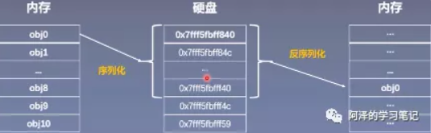
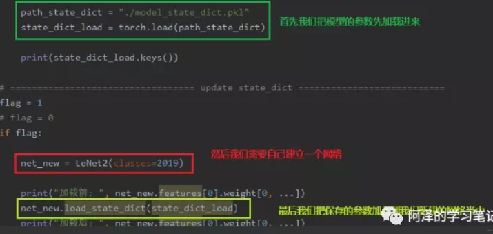
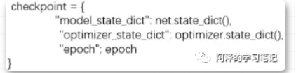
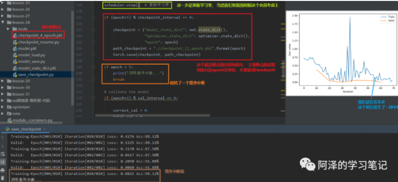
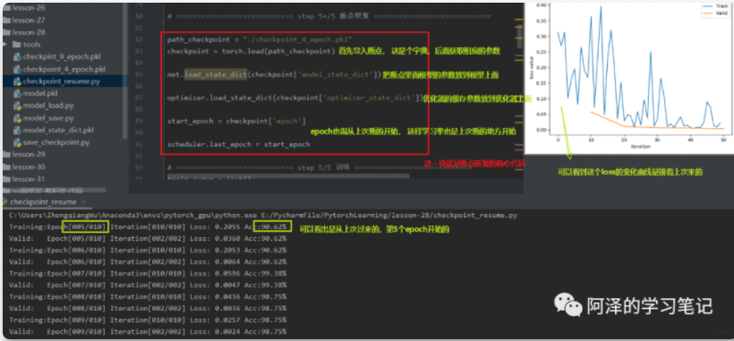
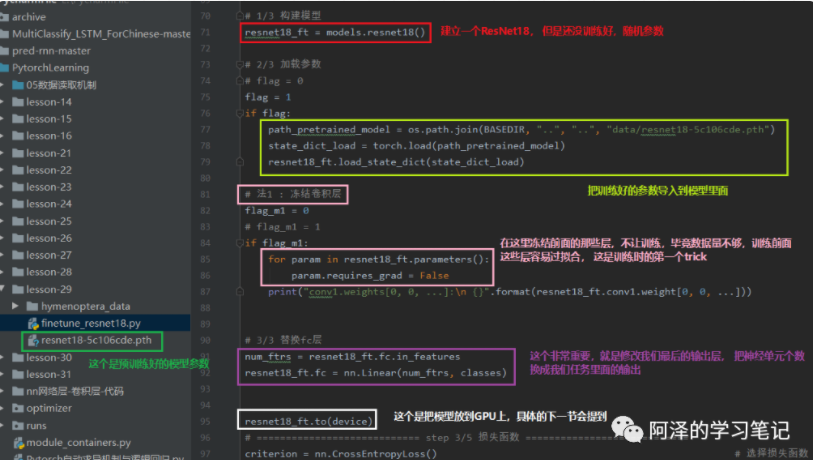
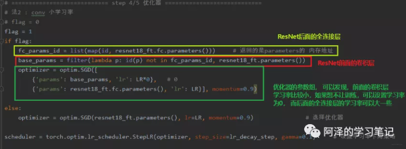
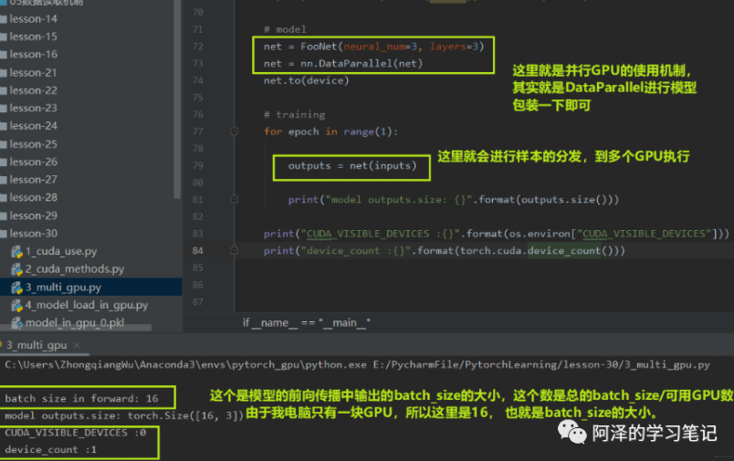
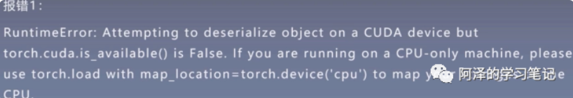
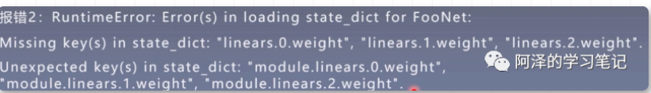

# 1.大纲

- 模型的保存与加载
- 模型的 finetune
- GPU 使用
- Pytorch 的常见报错

# 2. 模型的保存与加载

## **2.1 序列化与反序列化**

序列化就是说内存中的某一个对象保存到硬盘当中，以二进制序列的形式存储下来，这就是一个序列化的过程。而反序列化，就是将硬盘中存储的二进制的数，反序列化到内存当中，得到一个相应的对象，这样就可以再次使用这个模型了。



序列化和反序列化的目的就是将我们的模型长久的保存。

Pytorch 中序列化和反序列化的方法：

- torch.save (obj, f): `obj` 表示对象， 也就是我们保存的数据，可以是模型，张量， dict 等等， `f` 表示输出的路径
- torch.load (f, map_location): `f` 表示文件的路径， `map_location` 指定存放位置， CPU 或者 GPU， 这个参数挺重要，在使用 GPU 训练的时候再具体说。

## **2.2 模型保存与加载的两种方式**

Pytorch 的模型保存有两种方法， 一种是保存整个 Module， 另外一种是保存模型的参数。

- 保存和加载整个 Module：torch.save (net, path)， torch.load (fpath)
- 保存模型参数：torch.save (net.state_dict (), path), net.load_state_dict (torch.load (path))

第一种方法比较懒，保存整个的模型架构， 比较费时占内存， 第二种方法是只保留模型上的可学习参数， 等建立一个新的网络结构，然后放上这些参数即可，所以推荐使用第二种。


如果保存的是整个模型：

```python
path_model = "./model.pkl"
net_load = torch.load (path_model)
```

保存的是模型参数：



## **2.3 模型断点续训练**

checkpoint 里面需要保存模型的数据，优化器的数据，还有迭代到了第几次。



错误模拟



断点训练：



# 3. 模型的 finetune

迁移学习：机器学习分支， 研究源域的知识如何应用到目标域，将源任务中学习到的知识运用到目标任务当中，用来提升目标任务里模型的性能。

模型微调的步骤：

1. 获取预训练模型参数（源任务当中学习到的知识）
2. 加载模型（load_state_dict）将学习到的知识放到新的模型
3. 修改输出层， 以适应新的任务

模型微调的训练方法：

- 固定预训练的参数 (requires_grad=False; lr=0)
- Features Extractor 较小学习率 (params_group)



训练时的 trick 还有第二个，就是不冻结前面的层，而是修改前面的参数学习率，因为我们的优化器里面有参数组的概念，我们可以把网络的前面和后面分成不同的参数组，使用不同的学习率进行训练，当前面的学习率为 0 的时候，就是和冻结前面的层一样的效果了，但是这种写法比较灵活



# 4. GPU 的使用

## 4.1 CPU VS GPU

CPU主要包括控制器和运算器

GPU处理统一的， 无依赖的大规模数据运算

## **4.2 数据迁移至 GPU**

Tensor 和 Module

- CPU -> GPU：data.to ("cpu")
- GPU -> CPU: data.to ("cuda")

tensor.to (*args,kwargs)

```python
x = torch.ones ((3,3))
x = x.to (torch.float64)    # 转换数据类型

x = torch.ones ((3,3))
x = x.to ("cuda")    # 设备转移
```

module.to (*args,kwargs)

```python
inear = nn.Linear (2,2)
linear.to (torch.double)  # 这样模型里面的可学习参数的数据类型变成 float64

gpu1 = torch.device ("cuda")
linear.to (gpu1)    # 把模型从 CPU 迁移到 GPU
```

torch.cuda 常用的方法：

1. torch.cuda.device_count (): 计算当前可见可用的 GPU 数
2. torch.cuda.get_device_name (): 获取 GPU 名称
3. torch.cuda.manual_seed (): 为当前 GPU 设置随机种子
4. torch.cuda.manual_seed_all (): 为所有可见可用 GPU 设置随机种子
5. torch.cuda.set_device (): 设置主 GPU（默认 GPU）为哪一个物理 GPU（不推荐）

`os.environ.setdefault ("CUDA_VISIBLE_DEVICES","2,3")` 通过这个方法合理的分配 GPU，使得多个人使用的时候不冲突。但是这里要注意一下， 这里的 2,3 指的是物理 GPU 的 2,3。但是在逻辑 GPU 上， 这里表示的 0,1。 


## **4.3 多 GPU 并行运算**

多 GPU 并且运算， 简单的说就是我又很多块 GPU，比如 4 块， 而这里面有个主 GPU， 当拿到样本数据之后，比如主 GPU 拿到了 16 个样本， 那么它会经过 16/4=4 的运算，把数据分成 4 份， 自己留一份，然后把那 3 份分发到另外 3 块 GPU 上进行运算， 等其他的 GPU 运算完了之后， 主 GPU 再把结果收回来负责整合。所以， 多 GPU 并行运算的三步：分发 -> 并行计算 -> 收回结果整合。

`torch.nn.DataParallel`: 包装模型，实现分发并行机制。


- module: 需要包装分发的模型
- device_ids: 可分发的 gpu, 默认分发到所有的可见可用GPU， 通常这个参数不管它，而是在环境变量中管这个。
- output_device: 结果输出设备， 通常是输出到主 GPU





在没有GPU的机器上运行



多GPU保存模型，普通模型使用

# 5. Pytorch 的常见报错

https://shimo.im/docs/PvgHytYygPVGJ8Hv


# 6.总结