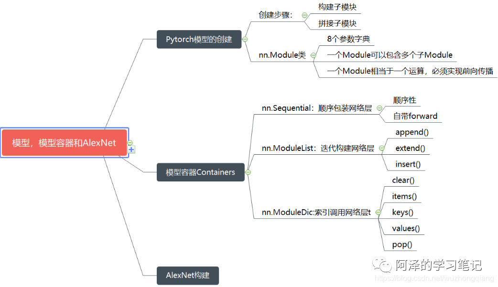
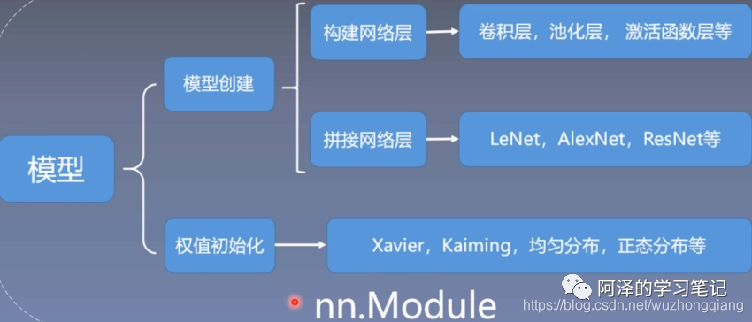
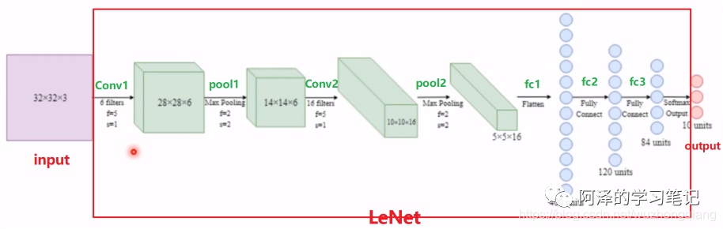
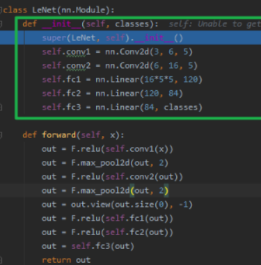
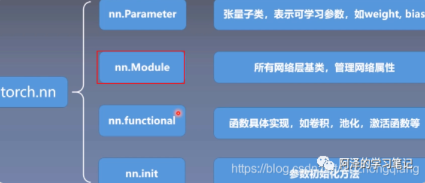
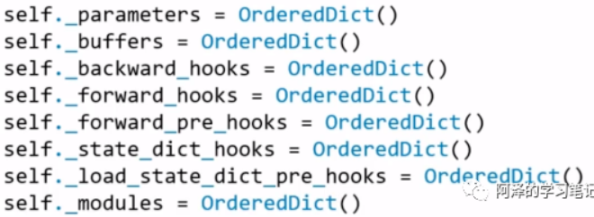
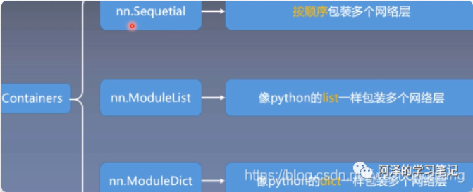
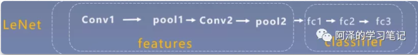
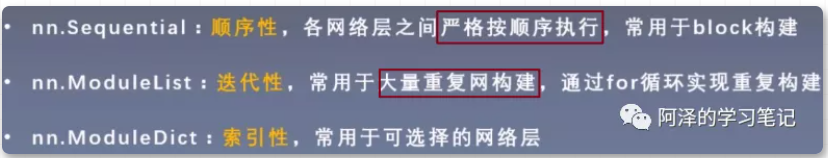
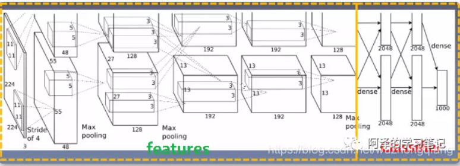

# 1.大纲

- Pytorch模型的建立

- Pytorch的容器

- AlexNet网络的构建

- 总结回顾

  

# 2.Pytorch 模型的创建



## **2.1 模型的创建步骤**

人民币二分类模型



模型的两大要素：

1. 构建子模块（比如 LeNet 里面的卷积层，池化层，全连接层）
2. 拼接子模块（有了子模块，我们把子模块按照一定的顺序，逻辑进行拼接起来得到最终的 LeNet 模型）



**「LeNet 类，继承了 nn.Module」**。**「它的`__init__`方法里面实现了各个子模块的构建」**

构建模型的两个要素

1. 构建子模块， 这个是在自己建立的模型（继承 nn.Module ）的`__init__()`方法
2. 拼接子模块， 这个是在模型的`forward()`方法中

## **2.2 nn.Module 类**



 nn.Module 中，有 8 个重要的属性，用于管理整个模型，他们都是以有序字典的形式存在着：



- `_parameters`：存储管理属于 nn.Parameter 类的属性，例如权值，偏置这些参数
- `_modules`: 存储管理 nn.Module 类， 比如 LeNet 中，会构建子模块，卷积层，池化层，就会存储在 modules 中
- `_buffers`: 存储管理缓冲属性，如 BN 层中的 running_mean，std 等都会存在这里面
- `state_dict_hooks`: 存储管理钩子函数（5 个与 hooks 有关的字典，这个先不用管）


- 一个 module 可以包含多个子 module（LeNet 包含卷积层，池化层，全连接层）
- 一个 module 相当于一个运算， 必须实现 forward() 函数（从计算图的角度去理解）
- 每个 module 都有 8 个字典管理它的属性（最常用的就是`_parameters`，`_modules` ）

# 3.模型容器 Containers



## 3.1 nn.Sequential

**「按顺序」**包装一组网络层

LeNet 模型,可以把前面的那部分划分为特征提取部分，后面的全连接层为模型部分。



```python
 class LeNetSequential(nn.Module):
     def __init__(self, classes):
         super(LeNetSequential, self).__init__()
         self.features = nn.Sequential(
             nn.Conv2d(3, 6, 5),
             nn.ReLU(),
             nn.MaxPool2d(kernel_size=2, stride=2),
             nn.Conv2d(6, 16, 5),
             nn.ReLU(),
             nn.MaxPool2d(kernel_size=2, stride=2),)
 
         self.classifier = nn.Sequential(
             nn.Linear(16*5*5, 120),
             nn.ReLU(),
             nn.Linear(120, 84),
             nn.ReLU(),
             nn.Linear(84, classes),)
 
     def forward(self, x):
         x = self.features(x)
         x = x.view(x.size()[0], -1)
         x = self.classifier(x)
         return x
```

第一部分是 features 模块，用于特征提取，第二部分是 classifier 部分，用于分类。


nn.Sequential 是 nn.module 的容器，用于**「按顺序」**包装一组网络层

- 顺序性：各网络层之间严格按照顺序构建，这时候一定要注意前后层数据的关系
- 自带 forward(): 自答的 forward 里，通过 for 循环依次执行前向传播运算


## **3.2 nn.ModuleList**

是 nn.module 的容器，用于包装一组网络层，以**「迭代」**方式调用网络层，主要方法：

- append(): 在 ModuleList 后面添加网络层

- extend(): 拼接两个 ModuleList

- insert(): 指定在 ModuleList 中位置插入网络层

  使用 ModuleList 来循环迭代的实现一个 20 个全连接层的网络的构建。

```python
class ModuleList(nn.Module):
    def __init__(self):
        super(ModuleList, self).__init__()
        self.linears = nn.ModuleList([nn.Linear(10, 10) for i in range(20)])

    def forward(self, x):
        for i, linear in enumerate(self.linears):
            x = linear(x)
        return x
```

## **3.3 nn.ModuleDict**

nn.ModuleDict 是 nn.module 的容器，用于包装一组网络层，以**「索引」**方式调用网络层，主要方法：

- clear(): 清空 ModuleDict
- items(): 返回可迭代的键值对(key-value pairs)
- keys(): 返回字典的键(key)
- values(): 返回字典的值(value)
- pop(): 返回一对键值对，并从字典中删除

可以通过 ModuleDict 实现网络层的选取

```python
class ModuleDict(nn.Module):
    def __init__(self):
        super(ModuleDict, self).__init__()
        self.choices = nn.ModuleDict({
            'conv': nn.Conv2d(10, 10, 3),
            'pool': nn.MaxPool2d(3)
        })

        self.activations = nn.ModuleDict({
            'relu': nn.ReLU(),
            'prelu': nn.PReLU()
        })

    def forward(self, x, choice, act):
        x = self.choices[choice](x)
        x = self.activations[act](x)
        return x
    
net = ModuleDict()
fake_img = torch.randn((4, 10, 32, 32))
output = net(fake_img, 'conv', 'relu')    # 在这里可以选择我们的层进行组合
print(output)
```

通过`self.choices`这个 ModuleDict 可以选择卷积或者池化

通过`self.activations`这个 ModuleDict 可以选取是用哪个激活函数



# 4.AlexNet构建

AlexNet 的特点如下：

- 采用 ReLu: 替换饱和激活函数， 减轻梯度消失
- 采用 LRN(Local Response Normalization): 对数据归一化，减轻梯度消失（后面被 Batch 归一化取代了）
- Dropout：提高全连接层的鲁棒性，增加网络的泛化能力
- Data Augmentation: TenCrop, 色彩修改



```python
class AlexNet(nn.Module):

    def __init__(self, num_classes=1000):
        super(AlexNet, self).__init__()
        self.features = nn.Sequential(
            nn.Conv2d(3, 64, kernel_size=11, stride=4, padding=2),
            nn.ReLU(inplace=True),
            nn.MaxPool2d(kernel_size=3, stride=2),
            nn.Conv2d(64, 192, kernel_size=5, padding=2),
            nn.ReLU(inplace=True),
            nn.MaxPool2d(kernel_size=3, stride=2),
            nn.Conv2d(192, 384, kernel_size=3, padding=1),
            nn.ReLU(inplace=True),
            nn.Conv2d(384, 256, kernel_size=3, padding=1),
            nn.ReLU(inplace=True),
            nn.Conv2d(256, 256, kernel_size=3, padding=1),
            nn.ReLU(inplace=True),
            nn.MaxPool2d(kernel_size=3, stride=2),
        )
        self.avgpool = nn.AdaptiveAvgPool2d((6, 6))
        self.classifier = nn.Sequential(
            nn.Dropout(),
            nn.Linear(256 * 6 * 6, 4096),
            nn.ReLU(inplace=True),
            nn.Dropout(),
            nn.Linear(4096, 4096),
            nn.ReLU(inplace=True),
            nn.Linear(4096, num_classes),
        )

    def forward(self, x):
        x = self.features(x)
        x = self.avgpool(x)
        x = torch.flatten(x, 1)
        x = self.classifier(x)
        return x
```

第一部分是一个 Sequential，由一系列的卷积池化模块构成，目的是提取图像的特征，然后是一个全局的池化层把特征进行整合，最后有一个 Sequential 是全连接层组成的，用于模型的分类。这样就完成了 AlexNet 网络的搭建，forward 函数汇总也是非常简单了，这里就不再详细赘述了。

# 5.总结

- 第一块就是 Pytorch 模型的构建步骤有两个子模块的构建和拼接， 然后就是学习了非常重要的一个类叫做 nn.Module，这个是非常重要的，后面的模型搭建中我们都得继承这个类，这就是祖宗级别的人物了。这里面有 8 个重要的参数字典，其中`_parameters`和`_modules`更是重中之重，所以以 LeNet 为例，通过代码调试的方式重点学习了 LeNet 的构建过程和细节部分。
- 第二块是我们的模型容器 Containers 部分，这里面先学习了 nn.Sequential， 这个是顺序搭建每个子模块， 常用于 block 构建，依然是通过代码调试看了它的初始化和自动前向传播机制。然后是 nn.ModuleList，这个类似于列表，常用于搭建结构相同的网络子模块，特点就是可迭代。最后是 nn.ModuleDict，这个的特点是索引性，类似于我们的 python 字典，常用于可选择的网络层。
- 第三块就是根据上面的所学分析了一个非常经典的卷积神经网络 AlexNet 的构建过程，当然也可以分析其他的经典网络构建的源代码了。当然，只是可以去看懂网络结构的代码，不要奢求一下子就会写，闭着眼就能自己敲出来， 如果你看一遍就能敲出这么复杂的网络结构，那就是超神了，祝贺你。反正我目前是做不到， 如果想达到用 Pytorch 写神经网络的地步，就需要后面多多实践，还是那句话，无他，唯手熟尔！;)